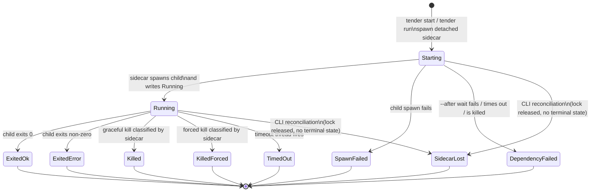

# Run Lifecycle

Tender models supervised runs, not raw processes. The sidecar is the normal writer of lifecycle state. The CLI writes lifecycle state only during reconciliation, in two cases: it infers `SidecarLost` (lock released with no terminal state), or it *heals* a terminal state (`Exited*` / `SpawnFailed` / `DependencyFailed`) by replaying the sidecar's own event-log record when the sidecar died in the WAL crash window before persisting `meta.json`.

Authority rules:

This ownership boundary follows Theme 2: One Authority Per Fact; see [../design-principles.md](../design-principles.md).

- Normal lifecycle writes happen in the sidecar:
  - `Starting -> Running`
  - `Starting -> SpawnFailed`
  - `Starting -> DependencyFailed`
  - `Running -> Exited* / Killed* / TimedOut`
- Reconciliation is the only lifecycle write performed outside the sidecar. It runs in `status`, `wait`, and foreground `run`, and writes in two cases:
  - `SidecarLost` — the lock is released with no terminal state (inferred provenance)
  - a *healed* terminal state — replayed from the sidecar's own event-log record after a WAL-window crash (the sidecar's original observation and provenance are preserved, not re-derived)

Important implementation detail:

- dependency waits happen while the run is still in `Starting`
- if `--after` is present, the sidecar writes `Starting` and signals readiness before it begins polling dependencies
- dependency binding is by `(session, run_id)`, so `--replace` on a dependency causes the waiter to fail rather than silently following a different execution

What this diagram omits:

- the OS-specific mechanics of kill, wait, and process identity
- PTY control, which is separate from run lifecycle and covered in [04-pty-lane.md](04-pty-lane.md)
