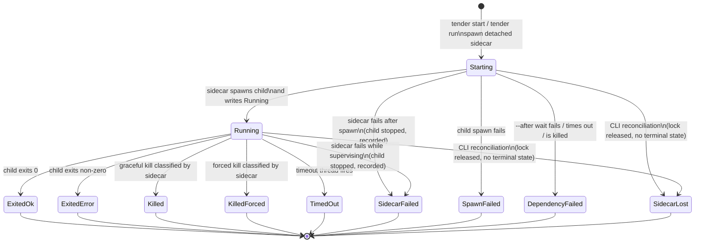

# Run Lifecycle

Tender models supervised runs, not raw processes. The sidecar is the normal writer of lifecycle state. The CLI writes lifecycle state only during reconciliation, in two cases: it infers `SidecarLost` (lock released with no terminal state), or it *heals* a terminal state (`Exited*` / `SpawnFailed` / `DependencyFailed`) by replaying the sidecar's own event-log record when the sidecar died in the WAL crash window before persisting `meta.json`.

**The invariant.** Once the child is spawned, at every instant either the sidecar is alive and owns the child, or meta is terminal and the child is dead, or the sidecar died by a true crash and the next reconciliation reaches the second state. No child is ever left running without a supervisor and without a word. A true crash is anything that ends the sidecar without unwinding: SIGKILL, OOM, `abort`, and any signal it does not handle, SIGTERM, SIGINT and SIGHUP included. The one gap is listed under Limits below.

```mermaid
stateDiagram-v2
    [*] --> Starting: tender start / tender run\nspawn detached sidecar

    Starting --> Running: sidecar spawns child\nand writes Running
    Starting --> SpawnFailed: child spawn fails
    Starting --> DependencyFailed: --after wait fails / times out / is killed
    Starting --> SidecarLost: CLI reconciliation\n(lock released, no terminal state)

    Running --> ExitedOk: child exits 0
    Running --> ExitedError: child exits non-zero
    Running --> Killed: graceful kill classified by sidecar
    Running --> KilledForced: forced kill classified by sidecar
    Running --> TimedOut: timeout thread fires
    Starting --> SidecarFailed: sidecar fails after spawn\n(child stopped, recorded)
    Running --> SidecarFailed: sidecar fails while supervising\n(child stopped, recorded)
    Running --> SidecarLost: CLI reconciliation\n(lock released, no terminal state)

    ExitedOk --> [*]
    ExitedError --> [*]
    Killed --> [*]
    KilledForced --> [*]
    TimedOut --> [*]
    SidecarFailed --> [*]
    SpawnFailed --> [*]
    DependencyFailed --> [*]
    SidecarLost --> [*]
```

Authority rules:

This ownership boundary follows Theme 2: One Authority Per Fact; see [../design-principles.md](../design-principles.md).

- Normal lifecycle writes happen in the sidecar:
  - `Starting -> Running`
  - `Starting -> SpawnFailed`
  - `Starting -> DependencyFailed`
  - `Running -> Exited* / Killed* / TimedOut`
  - `Starting | Running -> SidecarFailed` — the sidecar's own record that it failed while supervising (direct provenance, `supervision_failed` evidence); it is an `Exited` reason, so the child identity is kept
- Reconciliation is the only lifecycle write performed outside the sidecar. It runs in `status`, `wait`, and foreground `run`, and writes in two cases:
  - `SidecarLost` — the lock is released with no terminal state (inferred provenance). If the lost sidecar's child is still alive, reconciliation kills it first (see below)
  - a *healed* terminal state — replayed from the sidecar's own event-log record after a WAL-window crash (the sidecar's original observation and provenance are preserved, not re-derived)

Important implementation detail:

- dependency waits happen while the run is still in `Starting`
- if `--after` is present, the sidecar writes `Starting` and signals readiness before it begins polling dependencies
- dependency binding is by `(session, run_id)`, so `--replace` on a dependency causes the waiter to fail rather than silently following a different execution

## The lifecycle guard

In the sidecar (`src/sidecar/supervised_run.rs`), the child is owned by a `SupervisedRun` from the moment it is spawned, together with its kill handle, meta, the event writer, the session lock and any readiness still owed to the `start` client.

- `SupervisedRun<Spawned>::publish_running` is the only way to `SupervisedRun<Running>`, so what `Running` promises (the `--stdin` transport, the PTY attach socket) exists before `Running` is published.
- `finish(reason)` is the only normal exit.
- Any other exit (an error, an early return, a panic unwinding) stops the child through the platform kill path (its process group on Unix, including a PTY child, which leads its own session; its Job Object on Windows), then records `Exited { reason: SidecarFailed { step } }`.
- The typestate covers only the in-process guard. Persisted meta stays runtime-validated in `transition.rs`, because a type parameter does not survive serialization.

What a failed post-spawn step does:

| Step (`step`) | Action | Why |
|---|---|---|
| readiness to the client (`readiness`), and the meta rewrite recording a lost delivery | recover, warning | readiness is a courtesy to the client that asked, never a condition of the run (#71); it is a `#[must_use]` value, not a `Result` |
| `child_pid` breadcrumb (`breadcrumb`) | recover, warning | only crash recovery reads it |
| PTY attach bind (`attach_bind`) | recover, warning `attach unavailable` | attach is optional; binding before `Running` makes the failure visible rather than silent |
| `output.log` open (`output_log`) | recover: drain the output, warning `output not captured` | the run still has an exit worth recording, but a child nobody reads blocks on a full pipe |
| stdin transport (`stdin_transport`) | end the run | a `--stdin` run whose input can never arrive is a failed run |
| publishing `Running` (`running_meta`) | end the run | an unobservable `Running` would be a lie |
| observing the exit (`child_wait`) | end the run | an exit that cannot be observed cannot be classified |
| terminal meta after a normal exit | not a kill: salvage a copy to lost+found, still run hooks | the durable terminal event lets reconciliation heal meta |

A `SidecarFailed` run shows everywhere: meta carries `"reason":"SidecarFailed","step":…` and a `sidecar failed at <step>: <error>` warning; the event log gets a durable `run.sidecar_failed`; `wait`, `run` and `start` exit **5**; `--on-exit` hooks run with `TENDER_EXIT_REASON=SidecarFailed`; a `start` client still waiting receives the terminal snapshot. Exit code **3** (`SidecarLost`) keeps its meaning: the sidecar vanished, so the child may still be running.

If the failure record itself cannot be written, the child is still stopped. The failure is then reported on the channels still open: a `start` client still waiting gets an `ERROR:` saying the record failed, a copy of the record with the write error goes to `~/.tender/lost+found/events.jsonl`, and the `child_pid` breadcrumb stays so later recovery can find the child. Nothing claims a record that was not made.

## True crashes: reconciliation kills the orphan

The guard cannot run when the sidecar is killed by a signal it does not handle, dies of OOM, or aborts. Reconciliation holds the session lock throughout and re-reads meta under it, so a sidecar that wrote its terminal record just before releasing the lock always wins. When reconciliation then infers `SidecarLost`, it looks for the child the sidecar left behind: meta's `Running` child or, while meta is still `Starting` (the `--after` path), the `child_pid` breadcrumb. It kills that child only if the process with that PID has the recorded start time (`AliveVerified`), so a reused PID is never killed. The kill is forced and aimed at the process group, so `status` does not block on a grace period. The same identity rule applies to the older orphan-directory cleanup. The outcome is recorded: `orphan_killed` evidence and a warning when killed; a warning, and no kill, when the identity cannot be verified or the kill fails. A child that is already gone needs no note.

On Windows the child is in a kill-on-close Job Object held only by the sidecar, so the kernel kills the tree the moment the sidecar dies; reconciliation there only records the loss.

If the sidecar's durable `run.sidecar_failed` exists but its meta write failed, reconciliation heals meta from that event instead, even on the `--after` path where meta was still `Starting` (the breadcrumb supplies the child). The sidecar writes that event even when its forced kill did not take, so the healed record's child gets the same identity-verified kill and the same record: `orphan_killed` evidence beside `event_log_terminal` and a warning when killed, a warning when it cannot be verified or killed, nothing when it is already gone. No other healed record is checked: an observed exit means the sidecar reaped the child, and `SpawnFailed` or `DependencyFailed` never had one.

Limits:

- A crash in the moment between spawning the child and writing its `child_pid` breadcrumb, or after that write failed (recovered with a warning), leaves nothing for reconciliation to find while meta is absent or `Starting`. On Windows the Job Object still kills the child.
- A process that leaves the child's process group (its own `setsid`, or a job-control shell's jobs) is outside the group kill. A PTY child's session also receives SIGHUP when the sidecar's end of the terminal closes.
- The graceful stop sends SIGTERM to the group and escalates to SIGKILL only while the child itself is alive; a descendant that ignores SIGTERM can outlive a leader that exits promptly. The same holds for `--timeout` and `kill`, which share the kill path.
- A session whose sidecar crashed, or failed to record its failure, before any meta was written is handled by the older orphan-directory cleanup in `status`/`start`: it kills the breadcrumb's child by the same identity rule and removes the directory without a record. The failure record's only copy is then the lost+found one.

What this diagram omits:

- the OS-specific mechanics of kill, wait, and process identity
- PTY control, which is separate from run lifecycle and covered in [04-pty-lane.md](04-pty-lane.md)
