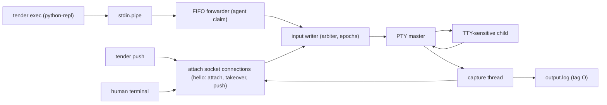

# PTY Lane

Tender has two execution lanes:

- pipe sessions: machine-friendly, `push` + `exec`, separate stdout/stderr
- PTY sessions: terminal-friendly, merged transcript, `push` + `attach`, no generic shell `exec`

This file describes the current PTY implementation, including the parts of
[cloud PTY control and replay](../plans/active/00_cloud-pty-control.md) that
have shipped: sidecar-enforced input ownership with controller epochs, the
attach handshake, takeover, bounded viewer delivery, and private peer-verified
attach sockets. Recording and the screen extension are still planned there.

Current PTY rules:

- `start --pty` spawns the child under a PTY; the sidecar owns the PTY master,
  whose descriptions are nonblocking with poll-aware read and write halves
- one sidecar input writer owns the run's `InputArbiter` and the PTY input; every
  write is authorized against the current controller epoch on that thread, and
  control requests are served before queued input
- `push` connects to the attach socket in push mode (`MODE_PUSH`), claims control
  as an agent (refused if anyone holds it, so concurrent pushes never
  interleave), streams frames written one at a time, and ends with
  `MSG_INPUT_DONE {written | revoked | closed, accepted, received}`; the CLI
  exits non-zero with the byte counts unless every byte was written
- `attach` must open with a v1 hello (`MSG_HELLO`); a plain attach is refused
  while a human holds control, and `--takeover` supersedes the holder, which
  receives `MSG_RETIRED` and is disconnected
- input queued by a superseded controller is never written and is recorded as
  `pty.input_revoked`; PTY `exec` frames still arrive over the stdin FIFO, whose
  forwarder is arbitrated the same way but cannot report an outcome
- the attach socket is bound in `~/.tender/sockets` (owner-only directory,
  `0600` socket, short run-derived name) and its breadcrumb published before the
  child is spawned; an unsafe directory, overlong path, or pre-existing path fails
  the start as `SpawnFailed` rather than running without a listener
- both ends verify the peer's user id; the hello must complete within one overall
  deadline, and any frame declaring more than 64 KiB closes the connection
- while a human is attached, `push` is rejected
- PTY output is merged and recorded as `O` lines in `output.log`; capture only
  offers output to the attached viewer's bounded queue (8 MiB), drained by that
  viewer's own sender thread, so a viewer that stops reading is disconnected
  (releasing its control) instead of stalling capture and the child

PTY-specific I/O shape:

Important exception:

- generic shell `exec` is rejected on PTY sessions
- `ExecTarget::PythonRepl` is the implemented exception: it uses a side-channel result file instead of transcript scraping, so PTY Python REPL sessions can still support `exec`

Planned but not yet implemented (see the cloud PTY plan):

- exact output recording and replay, including catch-up for a disconnected
  viewer
- runtime-directory and protected-temporary socket locations (only the
  persistent state root is implemented; other locations fail closed)
- continuous resize forwarding and a detach escape in the `attach` CLI
