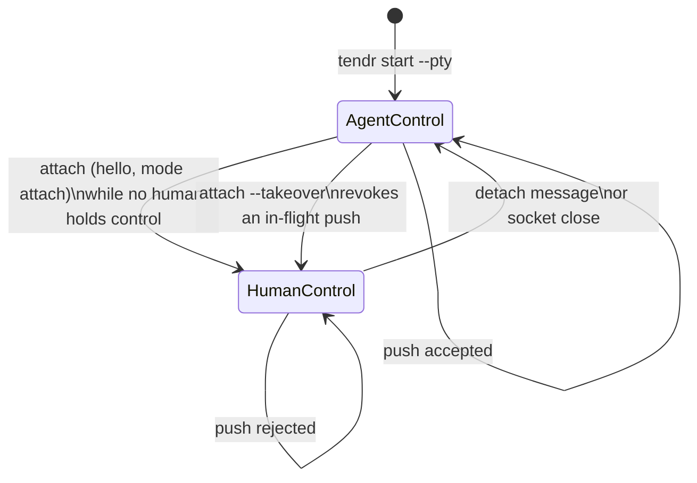
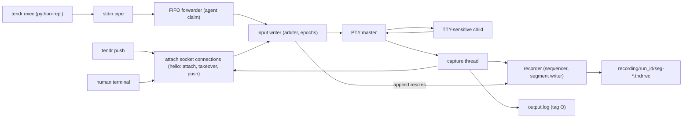

# PTY Lane

Tendr has two execution lanes:

- pipe sessions: machine-friendly, `push` + `exec`, separate stdout/stderr
- PTY sessions: terminal-friendly, merged transcript, `push` + `attach`, no generic shell `exec`

This file describes the current PTY implementation, including the parts of
[cloud PTY control and replay](../plans/active/00_cloud-pty-control.md) that
have shipped: sidecar-enforced input ownership with controller epochs, the
attach handshake, takeover, bounded viewer delivery, private peer-verified
attach sockets, and exact recording. Replay and the screen extension are still
planned there.

Current PTY rules:

- `start --pty` spawns the child under a PTY; the sidecar owns the PTY master,
  whose descriptions are nonblocking with poll-aware read and write halves
- one sidecar input writer owns the run's `InputArbiter` and the PTY input; every
  write is authorized against the current controller epoch on that thread, and
  control requests are served before queued input. That thread only decides
  ownership changes and revocations. The run's side effects on the session
  paths (`pty.control_changed`, `pty.input_revoked` and `recording.stopped`
  events, and the `pty.control` and `pty.recording` patches to `meta.json`)
  travel as typed effects on one channel to one effects thread, which writes
  them in order, so a slow state root never delays a takeover's
  acknowledgement, any input step, or capture. When the run ends, a flush on
  that channel writes every effect already decided before the terminal record;
  the thread then stops, and anything sent later is dropped, so nothing
  reaches the session paths after the run releases its lock
- `push` connects to the attach socket in push mode (`Mode::Push`), claims control
  as an agent (refused if anyone holds it, so concurrent pushes never
  interleave), streams frames written one at a time, and ends with
  `MSG_INPUT_DONE {written | revoked | closed, accepted, received}`; the CLI
  exits non-zero with the byte counts unless every byte was written. Both ends
  handle frames as the typed `attach_proto::Frame`: an outcome is `written`
  only with every received byte accepted, never reports more accepted than
  received, and one that breaks either rule, or has an unknown status, is a
  decode error at the boundary. A frame of a message type this version does
  not know (`FrameError::Unknown`) is read whole and ignored, like a malformed
  one, so a later version can add types; `Frame` holds only frames this
  version can write back exactly. A push
  whose every frame was written is `written` even if a takeover lands before
  its end marker is served, and the CLI also succeeds when all of stdin was
  sent and accepted but a takeover cut the connection before the end marker
  was read
- `attach` must open with a v1 hello (`MSG_HELLO`); a plain attach is refused
  while a human holds control, and `--takeover` supersedes the holder, which
  is disconnected. `MSG_RETIRED` is sent first on a best-effort basis: a client
  that has stopped reading its output misses it and sees only end of stream
- input queued by a superseded controller is never written and is recorded as
  `pty.input_revoked`; PTY `exec` frames still arrive over the stdin FIFO, whose
  forwarder is arbitrated the same way but cannot report an outcome: it waits
  behind another agent's push, and a human holder refuses it (the frame is
  discarded and recorded as a run warning). A frame keeps the agent claim until
  the child has read all of it, even after its writer has closed the FIFO:
  `exec` closes it as soon as the frame is in the pipe, so a closed writer is
  how every frame ends, not a sign it was abandoned. A child that never reads
  again holds the input until a human uses `attach --takeover`
- the attach socket is bound in `~/.tendr/sockets` (owner-only directory,
  `0600` socket, short run-derived name) and its breadcrumb published before the
  child is spawned; an unsafe directory, overlong path, or pre-existing path fails
  the start as `SpawnFailed` rather than running without a listener. After
  spawn the lifecycle guard owns the socket; if the recorder, input writer or
  listener cannot start, it stops the child and records
  `SidecarFailed { step: attach_bind }`
  ([03-run-lifecycle.md](03-run-lifecycle.md#the-lifecycle-guard)). A sidecar
  killed outright cannot remove its socket; `prune` removes such orphans
  (reported as `sockets_removed`), but only a socket that no session
  breadcrumb names, that nothing listens on, and that is over a minute old, so
  a socket a live session could use is never touched. A crashed session's
  socket goes when the session is pruned or replaced
- both ends verify the peer's user id; the hello must complete within one overall
  deadline, and any frame declaring more than 64 KiB closes the connection
- the `attach` CLI keeps keyboard, session writes, and terminal output on
  separate paths: the main thread polls the keyboard and terminal size and only
  queues messages (resize and detach ahead of keystrokes), a sender thread
  writes them, and a reader thread writes output. `Ctrl-\ d` detaches (`Ctrl-\`
  twice sends one; `--escape none` disables it); size changes are forwarded as
  they happen. Leaving never waits on a blocked path, and the terminal is
  restored without draining output. A connection whose input is backed up is
  still released promptly when its client hangs up
- while a human is attached, `push` is rejected
- PTY output is merged and recorded as `O` lines in `output.log`; capture only
  offers output to the attached viewer's bounded queue (8 MiB), drained by that
  viewer's own sender thread, so a viewer that stops reading is disconnected
  (releasing its control) instead of stalling capture and the child
- the child starts at 24×80. Each run is recorded exactly
  ([format](../plans/specs/pty-recording-format.md)) under
  `<session>/recording/<run_id>/` (`0700` directories, `0600` segments): capture
  offers every output chunk, and the input writer applies each resize while
  holding the recorder's sequencer, so output that follows a new size is always
  recorded after it. A resize frame with a zero dimension does not parse and
  is ignored. Sequencing never
  waits for storage; one recorder thread appends, rotates at 64 MiB, publishes
  segments atomically, and syncs at most a second apart and on close. Input is
  not recorded
- recording stops explicitly at the last completed append when the run reaches
  1 GiB, storage fails, 16 MiB of output waits for storage, or storage is still
  stalled at close; an append completing after the stop is cut back off. The
  recorder only queues the stop on the run's effects channel, at the moment it
  stops, so it is written off the capture and storage paths as
  `recording.stopped` and in `meta.json` (`pty.recording.state: Stopped`, with
  the last recorded sequence) before the run's terminal record, never after it.
  The run ends with a warning, and the child and viewers keep running

PTY-specific I/O shape:

Important exception:

- generic shell `exec` is rejected on PTY sessions
- `ExecTarget::PythonRepl` is the implemented exception: it uses a side-channel result file instead of transcript scraping, so PTY Python REPL sessions can still support `exec`

Planned but not yet implemented (see the cloud PTY plan):

- replay and export of recordings, and catch-up for a disconnected viewer
  (viewers are still fed before their records are appended, since they carry no
  cursor yet)
- recording policy at launch (`--record-input`, recording off), configurable
  limits, store-wide retention and expiry, and a stopped-recording notice to
  attached clients
- runtime-directory and protected-temporary socket locations (only the
  persistent state root is implemented; other locations fail closed)
